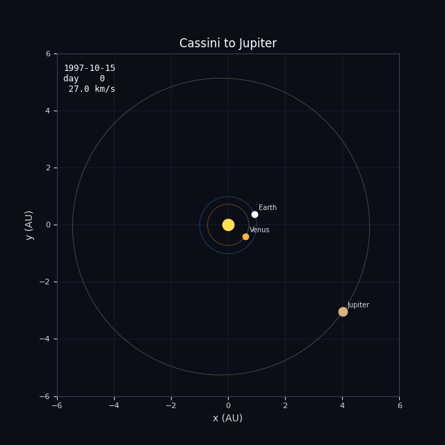
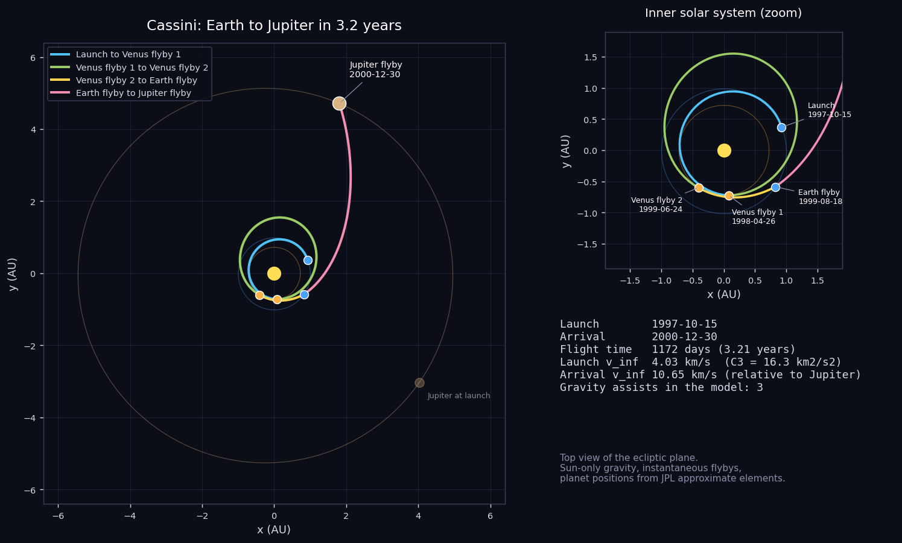
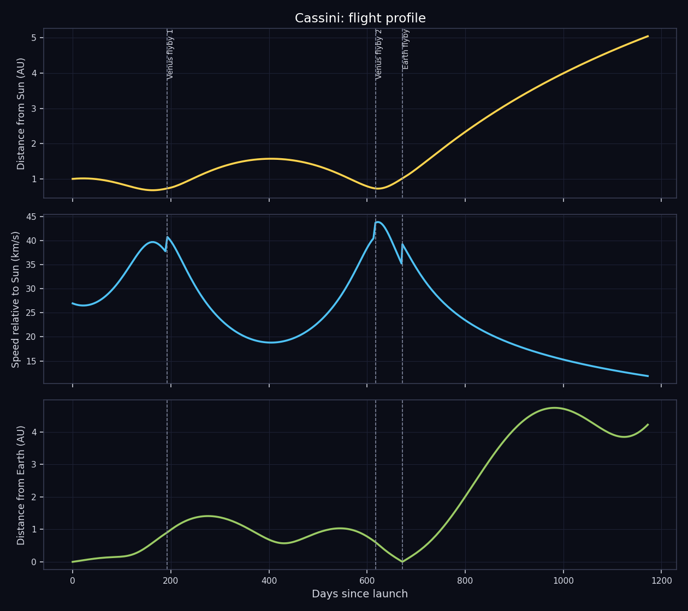

# Cassini: Earth to Jupiter

Reconstructing Cassini's Venus-Venus-Earth-Jupiter route, up to its Jupiter flyby on the way to Saturn.



## The mission

Cassini-Huygens was a joint mission of NASA, the European Space Agency and the Italian space agency, headed for Saturn. It launched on 15 October 1997 on a Titan IVB-Centaur, the most powerful rocket available at the time, and it was still too heavy to fly to Saturn directly. The solution was a sequence of gravity assists, known as VVEJGA: Venus on 26 April 1998, a deep-space maneuver on 3 December 1998, Venus again on 24 June 1999, Earth on 18 August 1999 and finally Jupiter on 30 December 2000.

The Jupiter flyby, at a closest distance of about 9.7 million km, gave Cassini its last big push toward Saturn. It also doubled as a science opportunity. Galileo was still in orbit around Jupiter at the time, so for the first time two spacecraft studied the planet together, which made it possible to compare what Cassini saw from outside with what Galileo measured from inside the magnetosphere.

Cassini reached Saturn on 1 July 2004. The Huygens probe landed on Titan on 14 January 2005, the first landing in the outer solar system. After thirteen years in orbit, Cassini was deliberately sent into Saturn's atmosphere on 15 September 2017 to protect the moons Enceladus and Titan from contamination. This project covers only the first three years of the trip, from Earth to Jupiter.

- **Launch:** 15 October 1997, Titan IVB-Centaur
- **Gravity assists:** Venus 26 Apr 1998, Venus 24 Jun 1999, Earth 18 Aug 1999, Jupiter 30 Dec 2000
- **Saturn arrival:** 1 July 2004
- **End of mission:** 15 September 2017

## What this project does

The script rebuilds the heliocentric part of the trip, from Earth at launch to Jupiter at arrival, using the real event dates listed below. It places the planets with the JPL approximate orbital elements, solves Lambert's problem for the arc between each pair of events, propagates the spacecraft along that arc and plots the result. The trip is split at each of the 3 gravity assists into separate arcs, one per leg.

| Event | Date |
|---|---|
| Launch | 1997-10-15 |
| Venus flyby 1 | 1998-04-26 |
| Venus flyby 2 | 1999-06-24 |
| Earth flyby | 1999-08-18 |
| Jupiter flyby | 2000-12-30 |





## Run it

```
pip install -r requirements.txt
python main.py
```

That takes well under a minute and writes everything to the `output/` folder. Use `python main.py --no-gif` to skip the animation. Python 3.8 or newer, no accounts or data downloads needed.

## Output from the current run

```
Cassini - Earth to Jupiter

Launch     : 1997-10-15
Arrival    : 2000-12-30
Flight time: 1172 days (3.21 years)
Path length: 17.03 AU (2547 million km), heliocentric

#  event                 date           day  dist Sun
0  Launch                1997-10-15       0    1.00 AU
1  Venus flyby 1         1998-04-26     193    0.73 AU
2  Venus flyby 2         1999-06-24     617    0.72 AU
3  Earth flyby           1999-08-18     672    1.01 AU
4  Jupiter flyby         2000-12-30    1172    5.05 AU

Leg by leg (heliocentric conic between events)
  Launch -> Venus flyby 1: 193 d, semi-major axis 0.84 AU, v_inf out 4.03 km/s, v_inf in 5.96 km/s
  Venus flyby 1 -> Venus flyby 2: 424 d, semi-major axis 1.14 AU, v_inf out 6.97 km/s, v_inf in 6.96 km/s
  Venus flyby 2 -> Earth flyby: 55 d, semi-major axis 1.65 AU, v_inf out 9.41 km/s, v_inf in 15.92 km/s
  Earth flyby -> Jupiter flyby: 500 d, semi-major axis 4.20 AU, v_inf out 15.78 km/s, v_inf in 10.65 km/s

Flyby check (|v_inf| should match before and after an unpowered flyby)
  Venus flyby 1: in 5.96 / out 6.97 km/s (difference +1.01 km/s)
  Venus flyby 2: in 6.96 / out 9.41 km/s (difference +2.46 km/s)
  Earth flyby: in 15.92 / out 15.78 km/s (difference -0.14 km/s)
```

`output/trajectory.csv` holds the sampled path (date, position in AU, distance from the Sun, speed, distance from Earth) if you want to plot it yourself.

## How it works

- `trajectory.py` has the numerical part: planet positions from Keplerian elements, a universal-variable Lambert solver that also handles multi-revolution arcs, and a Kepler propagator.
- `mission.py` lists the events (body and date) for this mission. Change the dates there and rerun to see a different launch window.
- `main.py` solves the legs, samples the path and makes the plots, the CSV and the GIF.

Units are AU and days internally. The only gravity is the Sun's, and every flyby is treated as instantaneous, which is the usual patched-conic approximation.

## Limits of the model

The 1998 deep-space maneuver is not modeled. That is visible in the flyby check: the speed relative to Venus does not match across the two Venus flybys, which sit on either side of that maneuver, because in the real mission a rocket burn filled that gap. The Jupiter flyby is treated as the end of the simulation.

In general: the planet positions are an approximation (good to a few thousand km for the inner planets and a few hundred thousand km for Jupiter), the spacecraft is a point mass with no maneuvers, and the "flyby check" in the output shows how far each flyby is from conserving the speed relative to the planet. A real unpowered flyby conserves it exactly, so a large difference points at something the model leaves out, usually a deep-space maneuver. This is a reconstruction for learning and visualization, not mission-design software.

## Files

```
main.py            run this
mission.py         event list for Cassini
trajectory.py      orbit mechanics
requirements.txt
output/            plots, animation, CSV, summary
```
