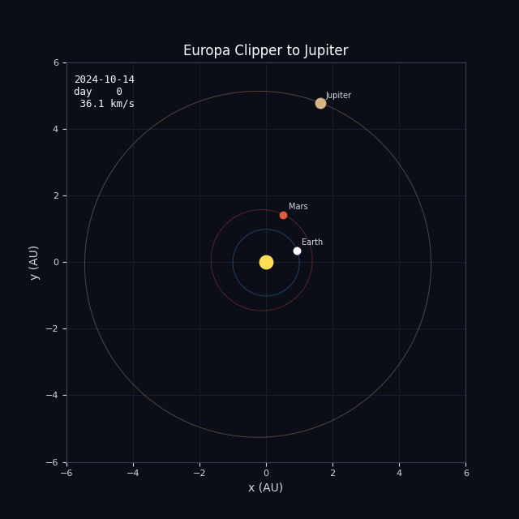
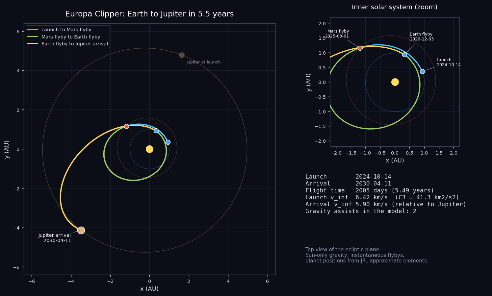
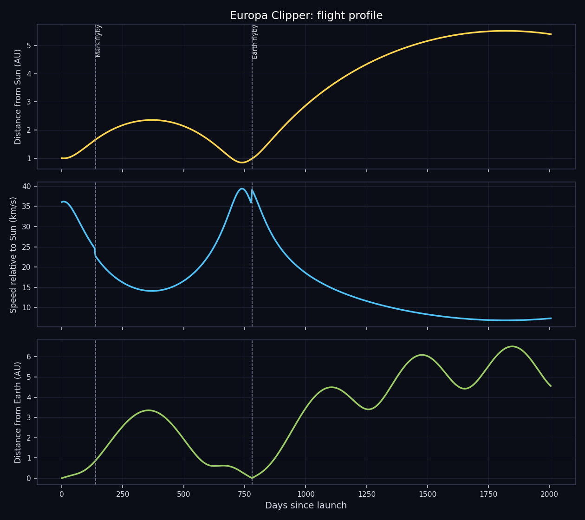

# Europa Clipper: Earth to Jupiter

Reconstructing the Mars-Earth route of Europa Clipper to Jupiter, a mission still in flight.



## The mission

Europa Clipper is NASA's first mission dedicated to an ocean world beyond Earth. It was built by the Jet Propulsion Laboratory with the Johns Hopkins Applied Physics Laboratory, and it is the largest spacecraft NASA has ever sent to another planet, with solar arrays about 30 m across. Its target is Europa, the ice-covered moon of Jupiter that hides a global ocean of salt water. The question is whether that ocean has the ingredients and the stability that life would need.

It launched on a Falcon Heavy from Kennedy Space Center on 14 October 2024. The rocket was not strong enough for a direct trip, so the plan uses two gravity assists. The Mars flyby took place on 1 March 2025, and the Earth flyby is scheduled for 3 December 2026, passing about 3,200 km above the surface. After that the spacecraft heads out beyond Jupiter's orbit before arriving in April 2030. At the time of writing (October 2026) it is still on its way, so everything after the Mars flyby in this project is the flight plan, not history.

Europa Clipper will not orbit Europa itself, because the radiation near the moon would destroy the electronics too quickly. It will orbit Jupiter instead and swing by Europa 49 times, the first in 2031, some passes as low as 25 km above the ice.

- **Launch:** 14 October 2024, Falcon Heavy
- **Mars flyby:** 1 March 2025
- **Earth flyby:** 3 December 2026 (planned)
- **Arrival at Jupiter:** April 2030 (planned)
- **Europa flybys:** 49 planned, starting 2031

## What this project does

The script rebuilds the heliocentric part of the trip, from Earth at launch to Jupiter at arrival, using the real event dates listed below. It places the planets with the JPL approximate orbital elements, solves Lambert's problem for the arc between each pair of events, propagates the spacecraft along that arc and plots the result. The trip is split at each of the 2 gravity assists into separate arcs, one per leg.

| Event | Date |
|---|---|
| Launch | 2024-10-14 |
| Mars flyby | 2025-03-01 |
| Earth flyby | 2026-12-03 |
| Jupiter arrival | 2030-04-11 |





## Run it

```
pip install -r requirements.txt
python main.py
```

That takes well under a minute and writes everything to the `output/` folder. Use `python main.py --no-gif` to skip the animation. Python 3.8 or newer, no accounts or data downloads needed.

## Output from the current run

```
Europa Clipper - Earth to Jupiter

Launch     : 2024-10-14
Arrival    : 2030-04-11
Flight time: 2005 days (5.49 years)
Path length: 19.34 AU (2894 million km), heliocentric

#  event                 date           day  dist Sun
0  Launch                2024-10-14       0    1.00 AU
1  Mars flyby            2025-03-01     138    1.66 AU
2  Earth flyby           2026-12-03     780    0.99 AU
3  Jupiter arrival       2030-04-11    2005    5.40 AU

Leg by leg (heliocentric conic between events)
  Launch -> Mars flyby: 138 d, semi-major axis 1.85 AU, v_inf out 6.42 km/s, v_inf in 10.29 km/s
  Mars flyby -> Earth flyby: 642 d, semi-major axis 1.60 AU, v_inf out 10.16 km/s, v_inf in 11.43 km/s
  Earth flyby -> Jupiter arrival: 1225 d, semi-major axis 3.23 AU, v_inf out 11.60 km/s, v_inf in 5.90 km/s

Flyby check (|v_inf| should match before and after an unpowered flyby)
  Mars flyby: in 10.29 / out 10.16 km/s (difference -0.14 km/s)
  Earth flyby: in 11.43 / out 11.60 km/s (difference +0.16 km/s)
```

`output/trajectory.csv` holds the sampled path (date, position in AU, distance from the Sun, speed, distance from Earth) if you want to plot it yourself.

## How it works

- `trajectory.py` has the numerical part: planet positions from Keplerian elements, a universal-variable Lambert solver that also handles multi-revolution arcs, and a Kepler propagator.
- `mission.py` lists the events (body and date) for this mission. Change the dates there and rerun to see a different launch window.
- `main.py` solves the legs, samples the path and makes the plots, the CSV and the GIF.

Units are AU and days internally. The only gravity is the Sun's, and every flyby is treated as instantaneous, which is the usual patched-conic approximation.

## Limits of the model

Dates after the Mars flyby come from the published flight plan and may shift slightly. The simulation does not include the trajectory correction maneuvers that the real spacecraft makes between flybys, so small differences from the official trajectory are expected.

In general: the planet positions are an approximation (good to a few thousand km for the inner planets and a few hundred thousand km for Jupiter), the spacecraft is a point mass with no maneuvers, and the "flyby check" in the output shows how far each flyby is from conserving the speed relative to the planet. A real unpowered flyby conserves it exactly, so a large difference points at something the model leaves out, usually a deep-space maneuver. This is a reconstruction for learning and visualization, not mission-design software.

## Files

```
main.py            run this
mission.py         event list for Europa Clipper
trajectory.py      orbit mechanics
requirements.txt
output/            plots, animation, CSV, summary
```
