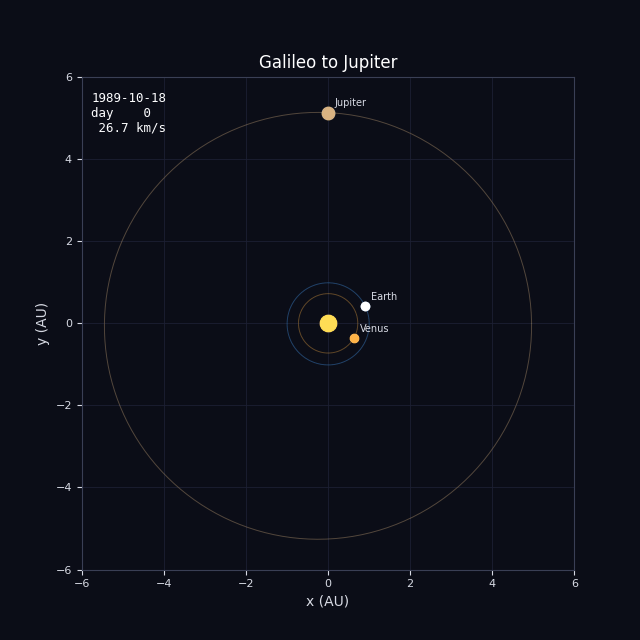
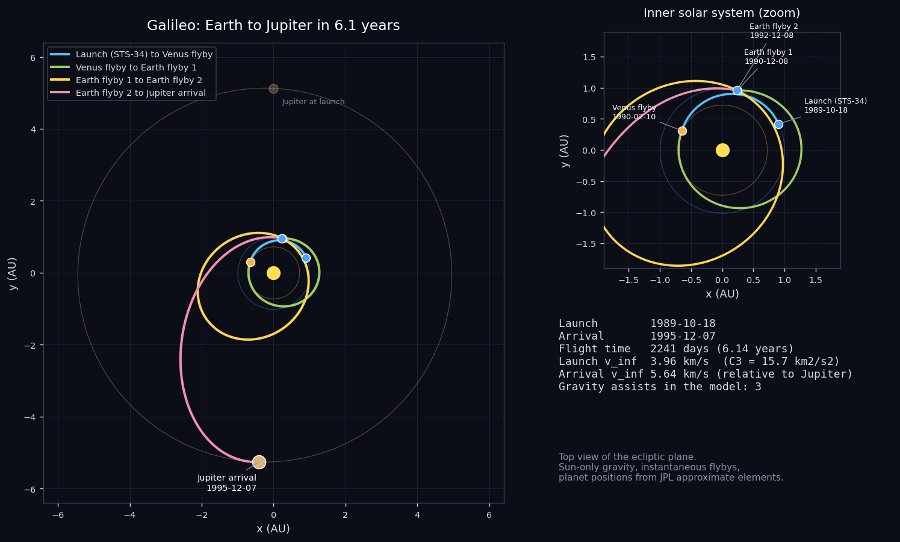
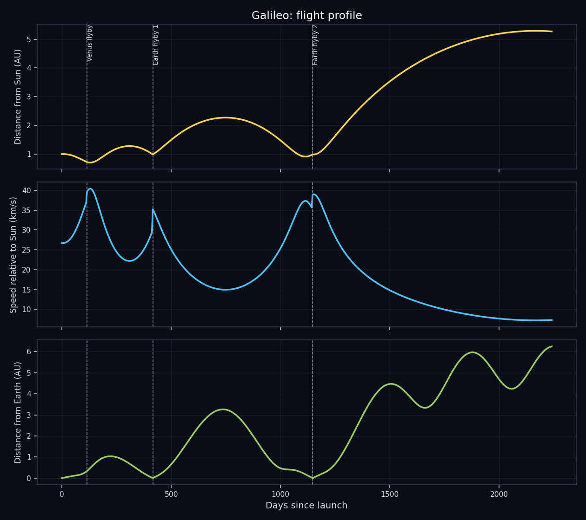

# Galileo: Earth to Jupiter

Reconstructing Galileo's Venus-Earth-Earth route to Jupiter, the first spacecraft to orbit the planet.



## The mission

Galileo was the first spacecraft to orbit Jupiter and the first to send a probe into the atmosphere of an outer planet. It was launched from the Space Shuttle Atlantis (mission STS-34) on 18 October 1989. The mission was originally meant to fly in 1986 with a powerful Centaur upper stage, but the Challenger accident and the cancellation of Centaur for the Shuttle forced a switch to a much weaker upper stage. That ruled out a direct flight, so the mission planners built a route that borrowed energy from the planets instead.

The route is called VEEGA (Venus-Earth-Earth gravity assist): a Venus flyby on 10 February 1990, an Earth flyby on 8 December 1990, a two-year loop around the Sun, a second Earth flyby on 8 December 1992, and then the long climb to Jupiter. On the way Galileo made the first close flyby of an asteroid (Gaspra, October 1991) and discovered a moon orbiting another asteroid (Dactyl, around Ida, August 1993). In April 1991 its main antenna failed to open fully, which cut the data rate drastically and forced the team to rebuild the mission around the small low-gain antenna.

Galileo arrived on 7 December 1995. The probe dropped into Jupiter's atmosphere and sent data for about an hour, while the orbiter began eight years of observations, including strong evidence for a salty ocean under Europa's ice and detailed monitoring of Io's volcanoes. On 21 September 2003 the spacecraft was steered into Jupiter on purpose so that it could never contaminate Europa.

- **Launch:** 18 October 1989, Space Shuttle Atlantis (STS-34)
- **Gravity assists:** Venus 10 Feb 1990, Earth 8 Dec 1990, Earth 8 Dec 1992
- **Arrival at Jupiter:** 7 December 1995
- **End of mission:** 21 September 2003, planned entry into Jupiter

## What this project does

The script rebuilds the heliocentric part of the trip, from Earth at launch to Jupiter at arrival, using the real event dates listed below. It places the planets with the JPL approximate orbital elements, solves Lambert's problem for the arc between each pair of events, propagates the spacecraft along that arc and plots the result. The trip is split at each of the 3 gravity assists into separate arcs, one per leg.

| Event | Date |
|---|---|
| Launch (STS-34) | 1989-10-18 |
| Venus flyby | 1990-02-10 |
| Earth flyby 1 | 1990-12-08 |
| Earth flyby 2 | 1992-12-08 |
| Jupiter arrival | 1995-12-07 |





## Run it

```
pip install -r requirements.txt
python main.py
```

That takes well under a minute and writes everything to the `output/` folder. Use `python main.py --no-gif` to skip the animation. Python 3.8 or newer, no accounts or data downloads needed.

## Output from the current run

```
Galileo - Earth to Jupiter

Launch     : 1989-10-18
Arrival    : 1995-12-07
Flight time: 2241 days (6.14 years)
Path length: 25.41 AU (3801 million km), heliocentric

#  event                 date           day  dist Sun
0  Launch (STS-34)       1989-10-18       0    1.00 AU
1  Venus flyby           1990-02-10     115    0.72 AU
2  Earth flyby 1         1990-12-08     416    0.99 AU
3  Earth flyby 2         1992-12-08    1147    0.99 AU
4  Jupiter arrival       1995-12-07    2241    5.27 AU

Leg by leg (heliocentric conic between events)
  Launch (STS-34) -> Venus flyby: 115 d, semi-major axis 0.83 AU, v_inf out 3.96 km/s, v_inf in 6.21 km/s
  Venus flyby -> Earth flyby 1: 301 d, semi-major axis 0.99 AU, v_inf out 5.99 km/s, v_inf in 8.82 km/s
  Earth flyby 1 -> Earth flyby 2: 731 d, semi-major axis 1.59 AU, v_inf out 8.82 km/s, v_inf in 9.05 km/s
  Earth flyby 2 -> Jupiter arrival: 1094 d, semi-major axis 3.14 AU, v_inf out 8.90 km/s, v_inf in 5.64 km/s

Flyby check (|v_inf| should match before and after an unpowered flyby)
  Venus flyby: in 6.21 / out 5.99 km/s (difference -0.22 km/s)
  Earth flyby 1: in 8.82 / out 8.82 km/s (difference +0.00 km/s)
  Earth flyby 2: in 9.05 / out 8.90 km/s (difference -0.15 km/s)
```

`output/trajectory.csv` holds the sampled path (date, position in AU, distance from the Sun, speed, distance from Earth) if you want to plot it yourself.

## How it works

- `trajectory.py` has the numerical part: planet positions from Keplerian elements, a universal-variable Lambert solver that also handles multi-revolution arcs, and a Kepler propagator.
- `mission.py` lists the events (body and date) for this mission. Change the dates there and rerun to see a different launch window.
- `main.py` solves the legs, samples the path and makes the plots, the CSV and the GIF.

Units are AU and days internally. The only gravity is the Sun's, and every flyby is treated as instantaneous, which is the usual patched-conic approximation.

## Limits of the model

The loop between the two Earth flybys is a special case. Both ends of that leg sit at almost the same point, which makes the usual Lambert solver ill-conditioned, so the simulation fixes the two-year period and picks the departure angle that keeps the speed relative to Earth equal to what the spacecraft arrived with. The asteroid encounters (Gaspra, Ida), the trajectory correction maneuvers and the details of each flyby are not modeled.

In general: the planet positions are an approximation (good to a few thousand km for the inner planets and a few hundred thousand km for Jupiter), the spacecraft is a point mass with no maneuvers, and the "flyby check" in the output shows how far each flyby is from conserving the speed relative to the planet. A real unpowered flyby conserves it exactly, so a large difference points at something the model leaves out, usually a deep-space maneuver. This is a reconstruction for learning and visualization, not mission-design software.

## Files

```
main.py            run this
mission.py         event list for Galileo
trajectory.py      orbit mechanics
requirements.txt
output/            plots, animation, CSV, summary
```
