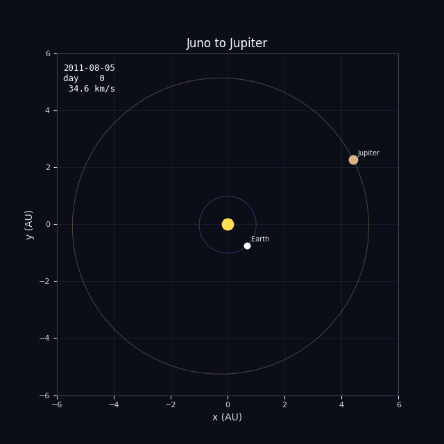
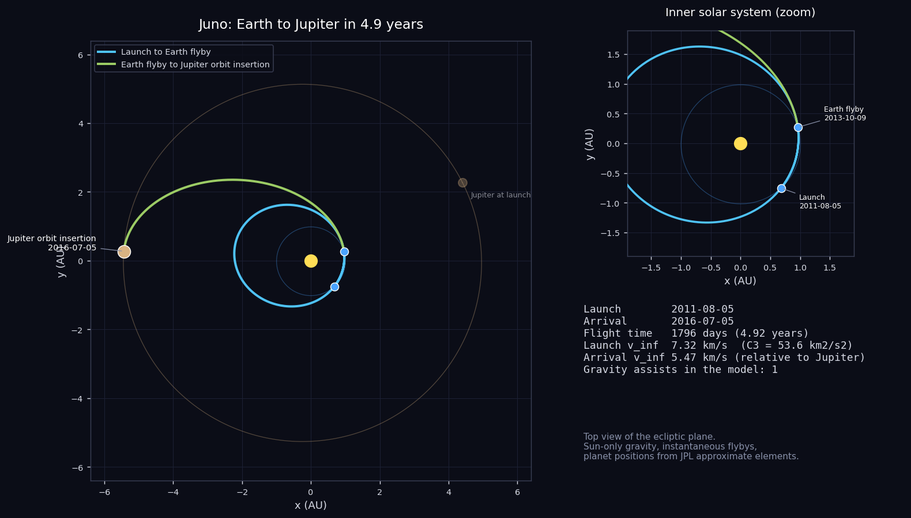
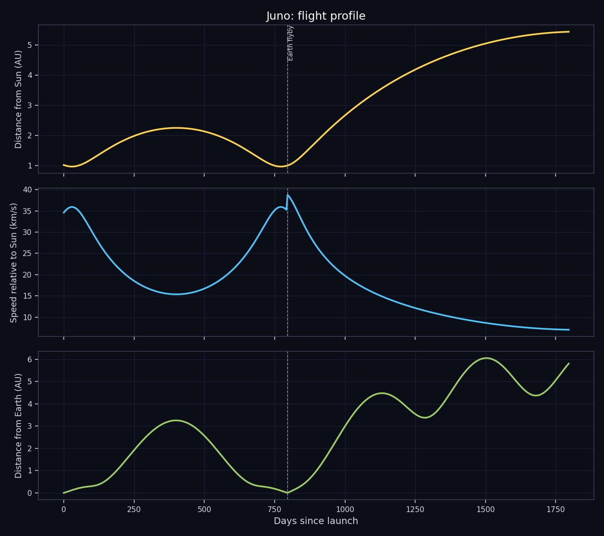

# Juno: Earth to Jupiter

Reconstructing Juno's route to Jupiter, with a two-year loop and an Earth flyby.



## The mission

Juno is a NASA New Frontiers mission, managed by the Jet Propulsion Laboratory with Scott Bolton of the Southwest Research Institute as principal investigator. It launched on an Atlas V 551 from Cape Canaveral on 5 August 2011. Its job is to look under Jupiter's clouds: measuring the planet's gravity and magnetic field, the amount of water in the atmosphere and whether there is a solid core. It is also the first spacecraft to operate at Jupiter on solar power, using three very large solar arrays instead of a nuclear generator.

The rocket could not send Juno straight to Jupiter, so the spacecraft first flew a loop of about two years out to the asteroid belt and back, with two deep-space maneuvers in August and September 2012. On 9 October 2013 it returned to Earth, passed a few hundred kilometers above the surface and used our planet's gravity to gain about 3.9 km/s of speed, enough to reach Jupiter.

Juno fired its main engine for about 35 minutes to enter orbit on 5 July 2016 (UTC). It travels in a long polar orbit that dips close to the cloud tops once every 53 days. The mission was extended well beyond the original plan and has included close flybys of the moons Europa (September 2022) and Io (December 2023 and February 2024). Three Lego figures (Galileo Galilei, the goddess Juno and the god Jupiter) are mounted on the spacecraft.

- **Launch:** 5 August 2011, Atlas V 551
- **Earth flyby:** 9 October 2013
- **Orbit insertion:** 5 July 2016 (UTC)
- **Orbit:** Polar, about 53 days

## What this project does

The script rebuilds the heliocentric part of the trip, from Earth at launch to Jupiter at arrival, using the real event dates listed below. It places the planets with the JPL approximate orbital elements, solves Lambert's problem for the arc between each pair of events, propagates the spacecraft along that arc and plots the result. The trip is split at the gravity assist into two arcs, one per leg.

| Event | Date |
|---|---|
| Launch | 2011-08-05 |
| Earth flyby | 2013-10-09 |
| Jupiter orbit insertion | 2016-07-05 |





## Run it

```
pip install -r requirements.txt
python main.py
```

That takes well under a minute and writes everything to the `output/` folder. Use `python main.py --no-gif` to skip the animation. Python 3.8 or newer, no accounts or data downloads needed.

## Output from the current run

```
Juno - Earth to Jupiter

Launch     : 2011-08-05
Arrival    : 2016-07-05
Flight time: 1796 days (4.92 years)
Path length: 19.04 AU (2849 million km), heliocentric

#  event                 date           day  dist Sun
0  Launch                2011-08-05       0    1.01 AU
1  Earth flyby           2013-10-09     796    1.00 AU
2  Jupiter orbit insertion2016-07-05    1796    5.44 AU

Leg by leg (heliocentric conic between events)
  Launch -> Earth flyby: 796 d, semi-major axis 1.61 AU, v_inf out 7.32 km/s, v_inf in 7.28 km/s
  Earth flyby -> Jupiter orbit insertion: 1000 d, semi-major axis 3.21 AU, v_inf out 10.34 km/s, v_inf in 5.47 km/s

Flyby check (|v_inf| should match before and after an unpowered flyby)
  Earth flyby: in 7.28 / out 10.34 km/s (difference +3.05 km/s)
```

`output/trajectory.csv` holds the sampled path (date, position in AU, distance from the Sun, speed, distance from Earth) if you want to plot it yourself.

## How it works

- `trajectory.py` has the numerical part: planet positions from Keplerian elements, a universal-variable Lambert solver that also handles multi-revolution arcs, and a Kepler propagator.
- `mission.py` lists the events (body and date) for this mission. Change the dates there and rerun to see a different launch window.
- `main.py` solves the legs, samples the path and makes the plots, the CSV and the GIF.

Units are AU and days internally. The only gravity is the Sun's, and every flyby is treated as instantaneous, which is the usual patched-conic approximation.

## Limits of the model

The model uses one single conic arc for the two-year loop. The real spacecraft made two deep-space maneuvers during it, so the real path was two different arcs. As a result the speed relative to Earth does not match before and after the Earth flyby in the flyby check. Treat the shape of the loop as approximate.

In general: the planet positions are an approximation (good to a few thousand km for the inner planets and a few hundred thousand km for Jupiter), the spacecraft is a point mass with no maneuvers, and the "flyby check" in the output shows how far each flyby is from conserving the speed relative to the planet. A real unpowered flyby conserves it exactly, so a large difference points at something the model leaves out, usually a deep-space maneuver. This is a reconstruction for learning and visualization, not mission-design software.

## Files

```
main.py            run this
mission.py         event list for Juno
trajectory.py      orbit mechanics
requirements.txt
output/            plots, animation, CSV, summary
```
