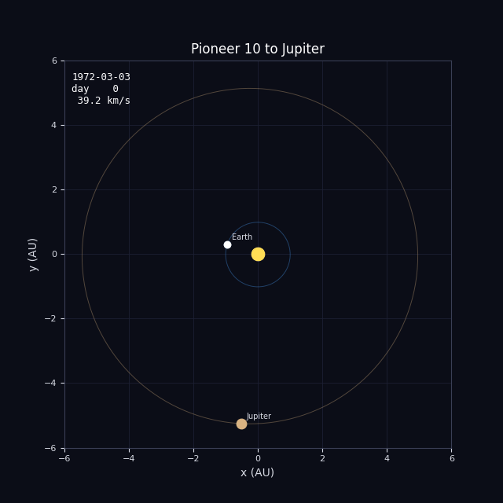
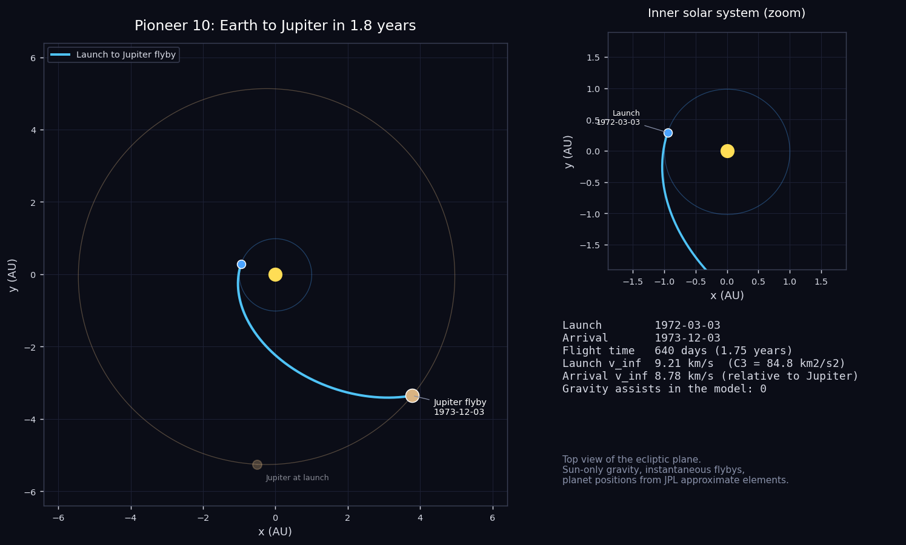
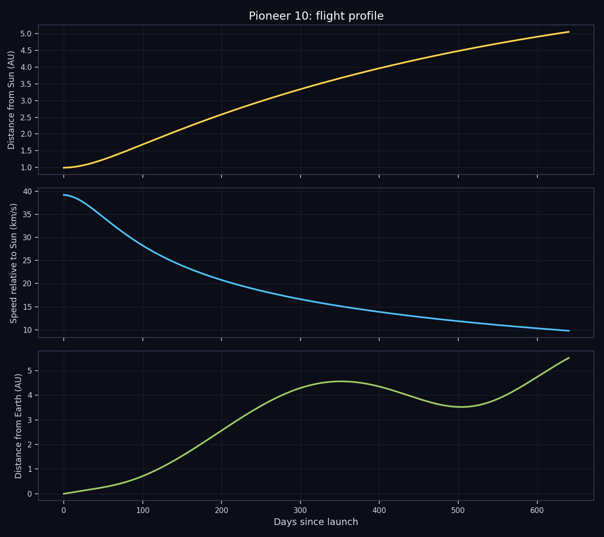

# Pioneer 10: Earth to Jupiter

Reconstructing the trajectory of Pioneer 10, the first spacecraft to fly past Jupiter.



## The mission

Pioneer 10 was NASA's first mission to the outer solar system. It was built by TRW and managed by NASA Ames Research Center, and it left Cape Canaveral on an Atlas-Centaur rocket on 3 March 1972 (UTC). At that point nobody knew whether a spacecraft could get through the asteroid belt in one piece. Pioneer 10 entered the belt in July 1972, came out the far side in February 1973 without damage, and showed that the belt is much emptier than people had feared.

On 3 December 1973 it passed roughly 132,000 km above Jupiter's cloud tops, the first spacecraft ever to do so. It sent back the first close-up pictures of the planet and measured a radiation environment far harsher than expected. Those measurements are the reason the Voyager and Galileo spacecraft were built with so much more shielding.

After Jupiter the spacecraft kept going out of the solar system, roughly in the direction of the star Aldebaran. It carries the Pioneer plaque, a small engraved message about where it came from. The last signal from Pioneer 10 was received on 23 January 2003.

- **Launch:** 3 March 1972, Atlas-Centaur
- **Jupiter closest approach:** 3 December 1973, about 132,000 km above the clouds
- **Last signal:** 23 January 2003

## What this project does

The script rebuilds the heliocentric part of the trip, from Earth at launch to Jupiter at arrival, using the real event dates listed below. It places the planets with the JPL approximate orbital elements, solves Lambert's problem for the arc between each pair of events, propagates the spacecraft along that arc and plots the result. There are no flybys in the model, so the whole trip is one arc.

| Event | Date |
|---|---|
| Launch | 1972-03-03 |
| Jupiter flyby | 1973-12-03 |





## Run it

```
pip install -r requirements.txt
python main.py
```

That takes well under a minute and writes everything to the `output/` folder. Use `python main.py --no-gif` to skip the animation. Python 3.8 or newer, no accounts or data downloads needed.

## Output from the current run

```
Pioneer 10 - Earth to Jupiter

Launch     : 1972-03-03
Arrival    : 1973-12-03
Flight time: 640 days (1.75 years)
Path length: 6.93 AU (1036 million km), heliocentric

#  event                 date           day  dist Sun
0  Launch                1972-03-03       0    0.99 AU
1  Jupiter flyby         1973-12-03     640    5.05 AU

Leg by leg (heliocentric conic between events)
  Launch -> Jupiter flyby: 640 d, semi-major axis 3.48 AU, v_inf out 9.21 km/s, v_inf in 8.78 km/s

Flyby check (|v_inf| should match before and after an unpowered flyby)
  (single direct arc, no flybys)
```

`output/trajectory.csv` holds the sampled path (date, position in AU, distance from the Sun, speed, distance from Earth) if you want to plot it yourself.

## How it works

- `trajectory.py` has the numerical part: planet positions from Keplerian elements, a universal-variable Lambert solver that also handles multi-revolution arcs, and a Kepler propagator.
- `mission.py` lists the events (body and date) for this mission. Change the dates there and rerun to see a different launch window.
- `main.py` solves the legs, samples the path and makes the plots, the CSV and the GIF.

Units are AU and days internally. The only gravity is the Sun's, and every flyby is treated as instantaneous, which is the usual patched-conic approximation.

## Limits of the model

This is the simplest case in the series: one direct arc from Earth to Jupiter, no gravity assists on the way. What happens at Jupiter itself (the flyby bending the path and flinging the spacecraft out of the solar system) is not part of the simulation, which stops at the planet.

In general: the planet positions are an approximation (good to a few thousand km for the inner planets and a few hundred thousand km for Jupiter), the spacecraft is a point mass with no maneuvers, and the "flyby check" in the output shows how far each flyby is from conserving the speed relative to the planet. A real unpowered flyby conserves it exactly, so a large difference points at something the model leaves out, usually a deep-space maneuver. This is a reconstruction for learning and visualization, not mission-design software.

## Files

```
main.py            run this
mission.py         event list for Pioneer 10
trajectory.py      orbit mechanics
requirements.txt
output/            plots, animation, CSV, summary
```
