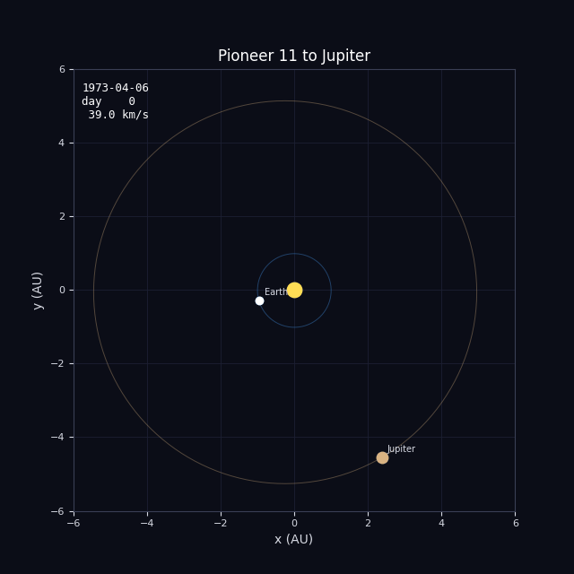
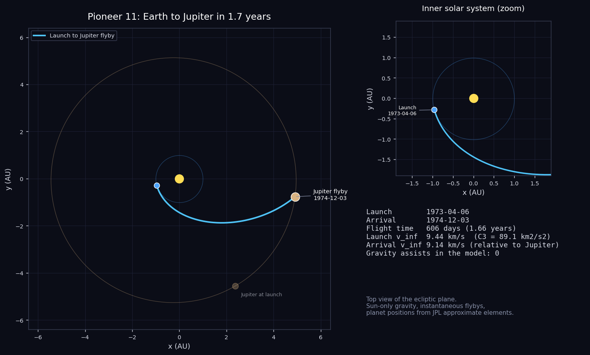
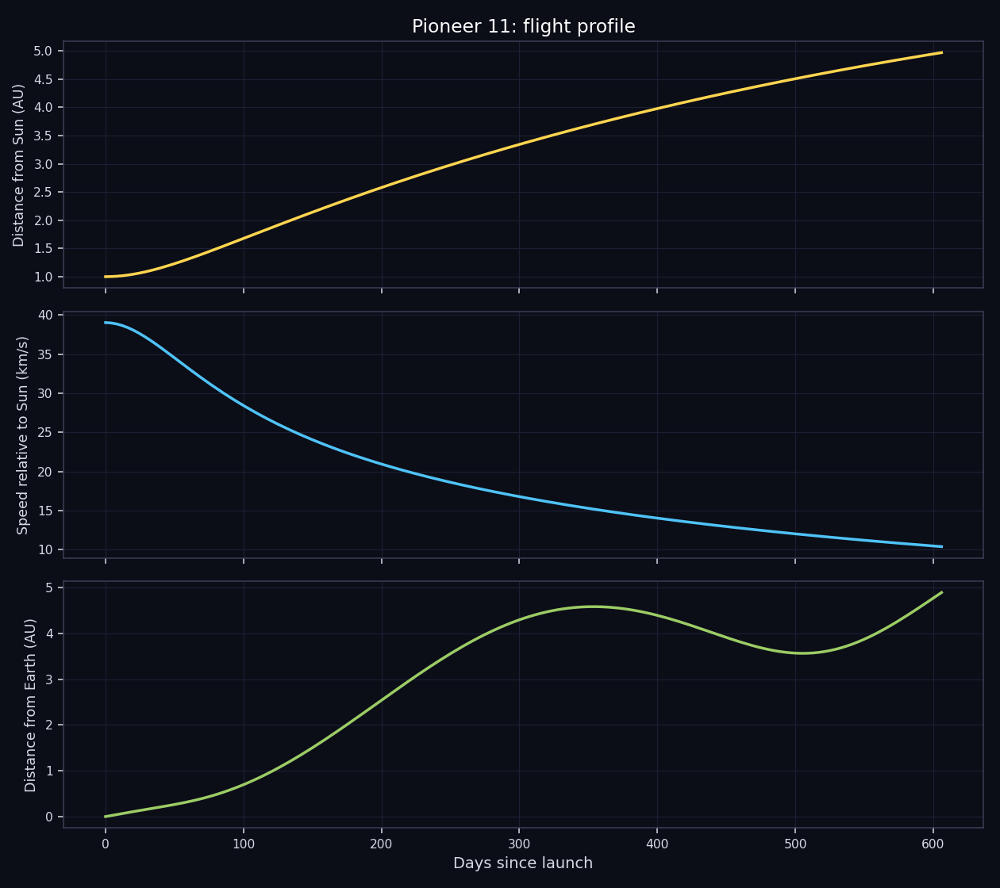

# Pioneer 11: Earth to Jupiter

Reconstructing the trajectory of Pioneer 11 from Earth to its Jupiter flyby.



## The mission

Pioneer 11 was the twin of Pioneer 10, launched on 6 April 1973 while its sibling was still on the way to Jupiter. That head start mattered: when Pioneer 10 reported the radiation levels at Jupiter, the Pioneer 11 team could still change the plan for their own spacecraft.

On 3 December 1974 Pioneer 11 passed about 34,000 km above Jupiter's cloud tops, much closer than its predecessor, and it flew over high latitudes, giving the first views of the polar regions. Jupiter's gravity then swung the spacecraft back across the solar system toward Saturn.

That detour made Pioneer 11 the first spacecraft to visit Saturn, on 1 September 1979, passing about 21,000 km above the cloud tops and crossing the ring plane. The data it gathered helped the Voyager teams plan their own Saturn encounters. Regular contact was lost in 1995 as the power supply faded.

- **Launch:** 6 April 1973, Atlas-Centaur
- **Jupiter closest approach:** 3 December 1974, about 34,000 km above the clouds
- **Saturn flyby:** 1 September 1979

## What this project does

The script rebuilds the heliocentric part of the trip, from Earth at launch to Jupiter at arrival, using the real event dates listed below. It places the planets with the JPL approximate orbital elements, solves Lambert's problem for the arc between each pair of events, propagates the spacecraft along that arc and plots the result. There are no flybys in the model, so the whole trip is one arc.

| Event | Date |
|---|---|
| Launch | 1973-04-06 |
| Jupiter flyby | 1974-12-03 |





## Run it

```
pip install -r requirements.txt
python main.py
```

That takes well under a minute and writes everything to the `output/` folder. Use `python main.py --no-gif` to skip the animation. Python 3.8 or newer, no accounts or data downloads needed.

## Output from the current run

```
Pioneer 11 - Earth to Jupiter

Launch     : 1973-04-06
Arrival    : 1974-12-03
Flight time: 606 days (1.66 years)
Path length: 6.78 AU (1015 million km), heliocentric

#  event                 date           day  dist Sun
0  Launch                1973-04-06       0    1.00 AU
1  Jupiter flyby         1974-12-03     606    4.97 AU

Leg by leg (heliocentric conic between events)
  Launch -> Jupiter flyby: 606 d, semi-major axis 3.56 AU, v_inf out 9.44 km/s, v_inf in 9.14 km/s

Flyby check (|v_inf| should match before and after an unpowered flyby)
  (single direct arc, no flybys)
```

`output/trajectory.csv` holds the sampled path (date, position in AU, distance from the Sun, speed, distance from Earth) if you want to plot it yourself.

## How it works

- `trajectory.py` has the numerical part: planet positions from Keplerian elements, a universal-variable Lambert solver that also handles multi-revolution arcs, and a Kepler propagator.
- `mission.py` lists the events (body and date) for this mission. Change the dates there and rerun to see a different launch window.
- `main.py` solves the legs, samples the path and makes the plots, the CSV and the GIF.

Units are AU and days internally. The only gravity is the Sun's, and every flyby is treated as instantaneous, which is the usual patched-conic approximation.

## Limits of the model

Like Pioneer 10 this is a single direct arc. The bend at Jupiter that sent the spacecraft on to Saturn, and everything after it, is outside the simulation.

In general: the planet positions are an approximation (good to a few thousand km for the inner planets and a few hundred thousand km for Jupiter), the spacecraft is a point mass with no maneuvers, and the "flyby check" in the output shows how far each flyby is from conserving the speed relative to the planet. A real unpowered flyby conserves it exactly, so a large difference points at something the model leaves out, usually a deep-space maneuver. This is a reconstruction for learning and visualization, not mission-design software.

## Files

```
main.py            run this
mission.py         event list for Pioneer 11
trajectory.py      orbit mechanics
requirements.txt
output/            plots, animation, CSV, summary
```
